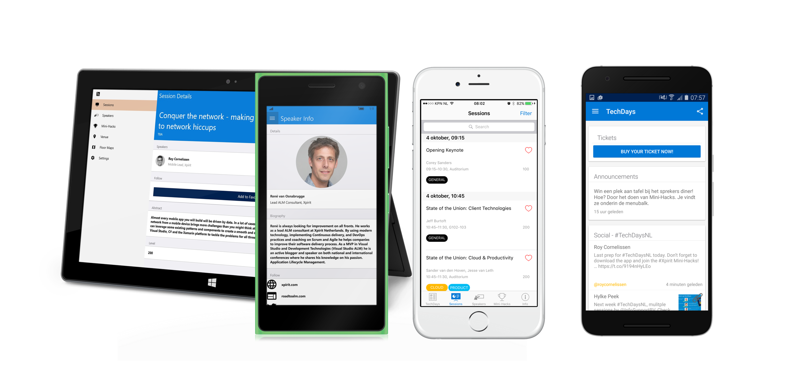
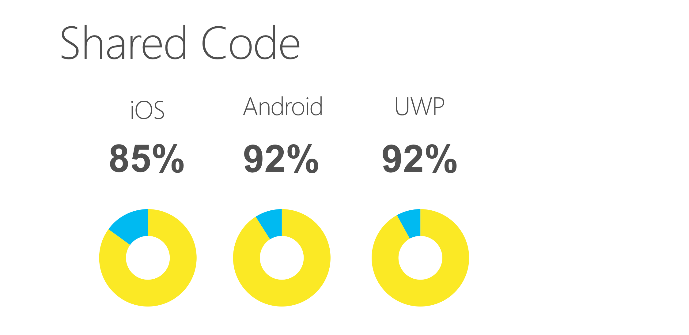
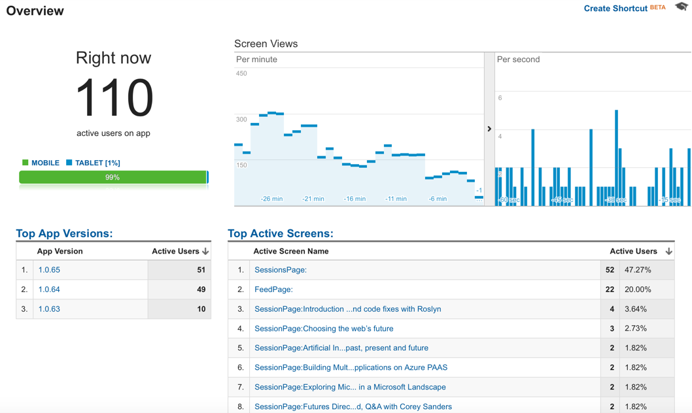

# TechDays 2016 Mobile App



## Download from App Store
* [iOS: App Store](https://itunes.apple.com/us/app/techdays-16/id1137372151) 
* [Android: Google Play](https://play.google.com/store/apps/details?id=com.xpirit.techdays)
* [Windows 10: Marketplace](https://www.microsoft.com/store/apps/9NBLGGH4TBWD) (Mobile & Desktop)

The TechDays 2016 app is full of awesome and includes everything that you would expect from a spectacular conference application, but features tons of deep integration with:

* Azure + Online/Offline Sync
* Barcode Scanning
* Calendar Integration
* Maps & Navigation
* Push Notifications
* Phone Dialer
* Wi-Fi configuration
* URL Navigation (Universal Links + Google App Indexing)
* iOS Today Widget and 3D-Touch integration
* A bunch of other great things

## Shared code details
This app is around 15,000 lines of code. The iOS version contains 85% shared code, the Android version contains 92% shared code, the UWP has 92% shared code, and our Azure backend contains 23% shared code with the clients!



## HockeyApp crash reporting
Not only was the TechDays 2016 app continuously deployed for testing with [HockeyApp](http://hockeyapp.net), but also provided events and crash reporting.


## Google Analytics monitoring
For a live overview of the usage of the app, TechDays 2016 reported page views and events to Google Analytics.



# Getting Started

## Mobile App
Open up src/XamarinEvolve.sln, which contains the iOS, Android, and Windows project. Simply restore your NuGet packages and build the application. It will probably not run out of the box. You need to provide some information in the following file:

*XamarinEvolve.Client.Utils/Helpers/Constants.cs*

There are also separate solution files for the different targets. We used these for CI builds for each of the platforms. src/XamarinEvolve.sln contains all targets.

## Feature Flags
We have added feature flags to the app that enable you to toggle on/off specific features in the app. For example, for TechDays we had to facilitate anonymous users due to privacy policies. We could not leverage the original login system, so we added a feature flag named `LoginEnabled` and set it to `false`.

Look for *XamarinEvolve.Client.Utils/Helpers/FeatureFlags.cs* to get an overview of all possible feature toggles.

## Data Source
Out of the box the TechDays Mobile app uses sample data provided by the XamarinEvolve.DataStore.Mock. This is great for development, but you can also test against the test/development read-only Azure App Server Mobile Apps backend. Simply head to *XamarinEvolve.Client.Utils/Helpers/FeatureFlags.cs*.

Simply change:

```
public static bool UseMocks => true;
```

to

```
public static bool UseMocks => false;
```

# Additional setup

## Push Notifications
All of the code for Azure Notification Hubs has been integrated into the Xamarin Evolve application, you will just need to setup your Azure Notifcation Hub Keys and Google Keys. Please read through the [startup guide](https://azure.microsoft.com/en-us/documentation/articles/notification-hubs-overview/) and then fill in your keys in: **XamarinEvolve.Utils/Helpers/Constants.cs**

## SQLite for UWP

Inside of Visual Studio go to Tools -> Extensions and Updates and install SQLite for Universal Windows Platform: https://visualstudiogallery.msdn.microsoft.com/4913e7d5-96c9-4dde-a1a1-69820d615936

## Google Maps API key (Android)
There is a “Debug” key that you can use out of the box, or you can configure your own. For Android, you'll need to obtain a Google Maps API key:
https://developer.xamarin.com/guides/android/platform_features/maps_and_location/maps/obtaining_a_google_maps_api_key/

Insert it in the Android project: `~/Properties/AndroidManifest.xml`:

    <application ...>
      ...
      <meta-data android:name="com.google.android.maps.v2.API_KEY" android:value="GOOGLE_MAPS_API_KEY" />
      ...
    </application>


## Bing Maps API Key (UWP)

In App.xaml.cs in the XamarinEvolve.UWP update Xamarin.FormsMaps.Init(string.Empty); with your API key from https://www.bingmapsportal.com/

## HockeyApp Crash Reporting
Simply head over to http://hockeyapp.net and register a new iOS/Android/UWP application and fill in the HockeyApp API Keys in **XamarinEvolve.Utils/Helpers/Constants.cs** to enable crash reporting.

## HockeyApp Crash Reporting
Simply head over to http://analytics.google.com and register a new mobile application and fill in the Google Analytics Tracking ID Keys in **XamarinEvolve.Utils/Helpers/Constants.cs** to enable monitoring.

## Build your own Backend
This repo contains a full backend that you can deploy to your own Azure App Service Mobile App Backend.

The backend runs on top of a SQL Azure database, which you can deploy with Entity Framework Code First Migrations.

Make sure to provide authentication details for:

- SQL Connection String
- Azure Service Bus Push Notification Hub
- Twitter API

## Tools
Of course a conference database needs data to work properly. We added some tools to the repo to facilitate this:

### DataManager
The DataManager is an ASP.NET MVC web application that provides CRUD screens for entering data, sending push notifications, etc. You can deploy the application to an Azure website and point it to the same SQL Azure database as the mobile backend API.

You'll find the source in *src/DataManager/DataManager.sln*

Make sure to provide authentication details for:

- SQL Connection String
- Azure Service Bus Push Notification Hub Connection and Endpoint

We used Auth0 for authenticating data manager user. You can quickly setup an account there and provide the `auth0:ClientId`, `auth0:ClientSecret` and `auth0:Domain` app settings. Or you can plug in your own identity provider if you like.

### MiniHacks
If you want to run a Mini-Hack contest at your conference, this mobile app can be used by your staff to provide QR unlock codes. Just change the API url in the source code and deploy the app with HockeyApp to your staff using Ad-Hoc deployment.

You'll find the source in *tools/MiniHacks/MiniHacks.sln*

### PhotoSizeChecker
We learned the hard way that size matters when it comes to speaker photos. In order for the app to work smoothly, the size of the avatars and full photos must be small. The PhotoSizeChecker is a console application that queries the speaker list and reports the size of both photos. We used it to regularly check the data that was entered into the database and correct pictures that were too big.

You'll find the source in *tools/PhotoSizeChecker/PhotoSizeChecker.sln*

# About
The TechDays Evolve mobile apps were handcrafted by Xpirit and based on the original Xamarin Evolve 2016 app.

**Development:**
* [Roy Cornelissen](http://github.com/roycornelissen)
* [Geert van der Cruijsen](https://github.com/geertvdc)
* [Marcel de Vries](https://github.com/vriesmarcel)

**Special thanks:**
* [James Montemagno](http://github.com/jamesmontemagno)

James and his team of Xamarins originally built the Xamarin Evolve application and has kindly provided us with his help and wisdom. Thanks James!
